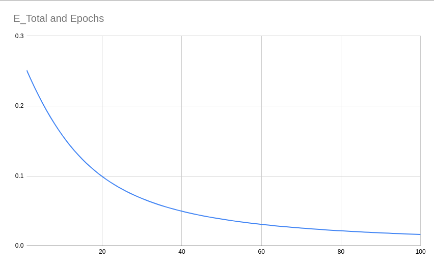

# Session 4 - Backpropagation & Architectural Basics

---
## Submission Info
Part 1:
See the Part 1 section below

Part 2:
- Final Validation Accuracy: `99.40`
- Parameters: `19629`
- Used Dropout: `yes`
- Used BN: `yes`
- Used Fully-Connected: `yes`
---

## Part 1

### Goal
Rewrite the whole excel sheet showing backpropagation, explaining each major step.

The excel sheet has two parts: forward and back propagation.

### Forward Propagation

The inputs are `x1` and `x2`.

The network consists of an input layers, a hidden layers, and an output layer. Each layer is followed by an activation function to introduce non-linearity into the network.

- Input: `x1, x2`
- output: `y1, y2`
- Weights: `w1, w2, w3, w4, w5, w6, w7, w8`
- Intermediate outputs: `h1, a_h1, o1, o2`
- Final Output: `a_o1, a_o2`
- MSE Loss: `E1, E2`

Although the parameters are initialised randomly, for our exercise we choose the following values.

| w1  | w2  |  w3  | w4  | w5  |  w6  | w7  |  w8  |
| :-: | :-: | :--: | :-: | :-: | :--: | :-: | :--: |
| 0.3 | 0.5 | -0.2 | 0.7 | 0.1 | -0.6 | 0.3 | -0.9 |

The inputs `x1` and `x2` are used to calculate the neuron values of the hidden layer using the following equation.

`h1 = (w1 * x1) + (w2 * x2)`

`h2 = (w3 * x1) + (w4 * x2)`

These outputs are then passed through a sigmoid function.

`a_h1 = σ(h1) = 1/(1 + exp(-h1))`

`a_h2 = σ(h2) = 1/(1 + exp(-h2))`

Once we have the middle neurons, we then calculate the output neurons using the following equations.

`o1 (w5 * a_h1) * (w6 * a_h2)`

`o2 (w7 * a_h1) * (w8 * a_h2)`

Activations of these outputs.

`a_o1 = σ(o1) = 1/(1 + exp(-o1))`

`a_o2 = σ(o2) = 1/(1 + exp(-o2))`

Once we have the output from the network, we calculate the Mean Squared Error loss using our actual outputs.

`E1 = 0.5 * (y1 - a_o1)²`

`E2 = 0.5 * (y2 - a_o2)²`

Finally, we calculate the total loss using which we'll perform backpropagation.

`E_Total E1 + E2`

### Backward Propagation

During backpropagation, we first calculate the derivative of the total error with respect to all the weights using chain rule.

The final equations are:

`∂E_Total/∂w8 = (a_o2 - y2) * a_o2 * (1 - a_o2) * a_h2`

`∂E_Total/∂w7 = (a_o2 - y2) * a_o2 * (1 - a_o2) * a_h1`

`∂E_Total/∂w6 = (a_o1 - y1) * a_o1 * (1 - a_o1) * a_h2`

`∂E_Total/∂w5 = (a_o1 - y1) * a_o1 * (1 - a_o1) * a_h1`

`∂E_Total/∂w4 = [(a_o1 - y1) * a_o1 * (1 - a_o1) * w6 + (a_o2 - y2) * a_o2 * (1 - a_o2) * w8] * a_h2 * (1 - a_h2) * x2`

`∂E_Total/∂w3 = [(a_o1 - y1) * a_o1 * (1 - a_o1) * w6 + (a_o2 - y2) * a_o2 * (1 - a_o2) * w8] * a_h2 * (1 - a_h2) * x1`

`∂E_Total/∂w2 = [(a_o1 - y1) * a_o1 * (1 - a_o1) * w5 + (a_o2 - y2) * a_o2 * (1 - a_o2) * w7] * a_h1 * (1 - a_h1) * x2`

`∂E_Total/∂w1 = [(a_o1 - y1) * a_o1 * (1 - a_o1) * w5 + (a_o2 - y2) * a_o2 * (1 - a_o2) * w7] * a_h1 * (1 - a_h1) * x1`

Once we the gradients, we update the weights using the following equation.

`w_new = w_old - (LR * ∂E/∂w)`

`LR` is the learning rate which is used to ensure the update step aren't too large. If the LR is too big, the network may not converge at all.

### Learning Rate Experiment

Increasing the learning leads to faster convergence in 100 epochs. The total error reduces quickly for a higher learning rate.

- LR = 0.1
  

- LR = 0.2
  

- LR = 0.5
  

- LR = 0.8
  

- LR = 1.0
  

- LR = 2.0
  

### Screenshot

The excel sheet is present in `./part1/`. Here's a screenshot of the file.


## Part 2

### Goal
Get 99.4% validation accuracy within 20 epochs with less than 20k parameters, using BN, dropout, FC layer, and GAP

### Architecture
The network architecture consisted of three convolutional blocks, with decreasing number of convolutional layers before pooling. This is because we can extract the most information when the image is of higher resolution, so we perform multiple convolutions there. Lastly, there was GAP then a fully connected layer to map to the 10 classes.

ReLU, Batch Normalization, and Dropout were used in that order after each convolution except the last one. Dropout was done after each convolution with p=0.05 for all.

```
Net(
  (convblock1): Sequential(
    (0): Conv2d(1, 16, kernel_size=(3, 3), stride=(1, 1), padding=(1, 1))
    (1): ReLU()
    (2): BatchNorm2d(16)
    (3): Dropout2d(0.05)
    (4): Conv2d(16, 16, kernel_size=(3, 3), stride=(1, 1))
    (5): ReLU()
    (6): BatchNorm2d(16)
    (7): Dropout2d(0.05)
    (8): Conv2d(16, 32, kernel_size=(3, 3), stride=(1, 1))
    (9): ReLU()
    (10): BatchNorm2d(32)
    (11): Dropout2d(0.05)
    (12): MaxPool2d(kernel_size=2, stride=2, padding=0, dilation=1, ceil_mode=False)
  )
  (convblock2): Sequential(
    (0): Conv2d(32, 16, kernel_size=(3, 3), stride=(1, 1), padding=(1, 1))
    (1): ReLU()
    (2): BatchNorm2d(16)
    (3): Dropout2d(0.05)
    (4): Conv2d(16, 20, kernel_size=(3, 3), stride=(1, 1), padding=(1, 1))
    (5): ReLU()
    (6): BatchNorm2d(20)
    (7): Dropout2d(0.05)
    (8): MaxPool2d(kernel_size=2, stride=2, padding=0, dilation=1, ceil_mode=False)
  )
  (convblock3): Sequential(
    (0): Conv2d(20, 25, kernel_size=(3, 3), stride=(1, 1), padding=(1, 1))
    (1): AvgPool2d(kernel_size=6, stride=6, padding=0)
  )
  (fcblock): Linear(in_features=25, out_features=10, bias=True)
)
```

Total of 19,629 parameters

```

```

### Training Logs
Target hit at epoch 14

```
[Epoch 1] loss=0.1206
Test set: Average loss: 0.0907, Accuracy: 9704/10000 (97.04%)

[Epoch 2] loss=0.0607
Test set: Average loss: 0.0518, Accuracy: 9841/10000 (98.41%)

[Epoch 3] loss=0.1203
Test set: Average loss: 0.0393, Accuracy: 9862/10000 (98.62%)

[Epoch 4] loss=0.1413
Test set: Average loss: 0.0341, Accuracy: 9886/10000 (98.86%)

[Epoch 5] loss=0.0329
Test set: Average loss: 0.0305, Accuracy: 9904/10000 (99.04%)

[Epoch 6] loss=0.0126
Test set: Average loss: 0.0262, Accuracy: 9915/10000 (99.15%)

[Epoch 7] loss=0.063
Test set: Average loss: 0.0246, Accuracy: 9917/10000 (99.17%)

[Epoch 8] loss=0.0429
Test set: Average loss: 0.0257, Accuracy: 9916/10000 (99.16%)

[Epoch 9] loss=0.068
Test set: Average loss: 0.0333, Accuracy: 9893/10000 (98.93%)

[Epoch 10] loss=0.0626
Test set: Average loss: 0.0249, Accuracy: 9918/10000 (99.18%)

[Epoch 11] loss=0.037
Test set: Average loss: 0.0255, Accuracy: 9920/10000 (99.20%)

[Epoch 12] loss=0.0054
Test set: Average loss: 0.0223, Accuracy: 9919/10000 (99.19%)

[Epoch 13] loss=0.0232
Test set: Average loss: 0.0248, Accuracy: 9913/10000 (99.13%)

[Epoch 14] loss=0.0391
Test set: Average loss: 0.0193, Accuracy: 9941/10000 (99.41%)

[Epoch 15] loss=0.011
Test set: Average loss: 0.0216, Accuracy: 9933/10000 (99.33%)

[Epoch 16] loss=0.0156
Test set: Average loss: 0.0222, Accuracy: 9931/10000 (99.31%)

[Epoch 17] loss=0.0556
Test set: Average loss: 0.0218, Accuracy: 9924/10000 (99.24%)

[Epoch 18] loss=0.0108
Test set: Average loss: 0.0219, Accuracy: 9927/10000 (99.27%)

[Epoch 19] loss=0.0042
Test set: Average loss: 0.0218, Accuracy: 9932/10000 (99.32%)

```

Colab Notebook Link: https://colab.research.google.com/github/ShreyJ1729/EVA6-TSAI/blob/main/04-Backprop&ArchBasics/04-Backprop&ArchBasics.ipynb