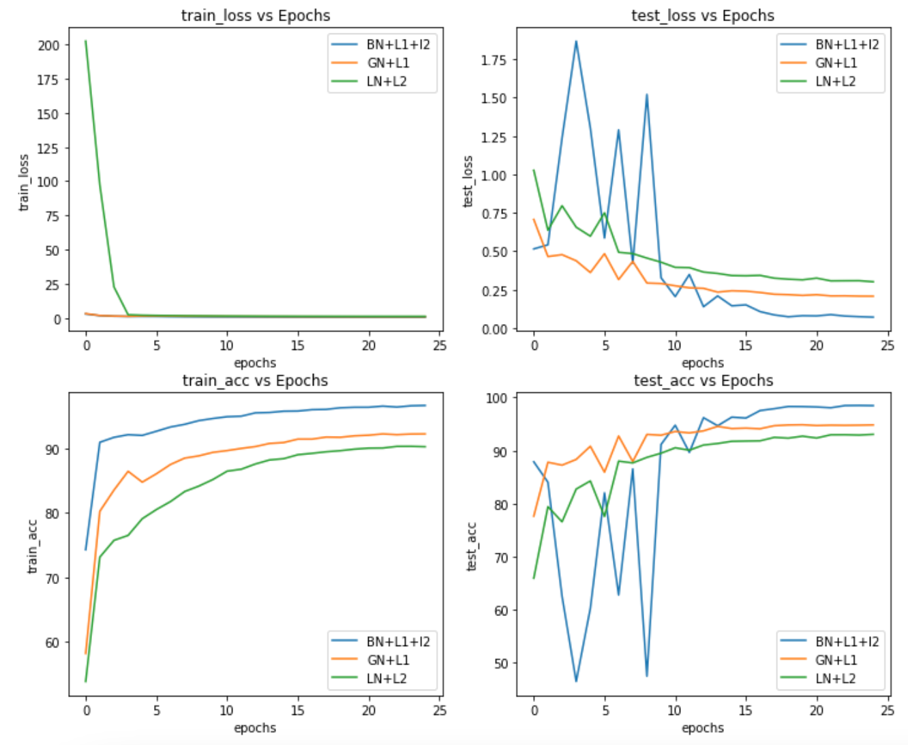
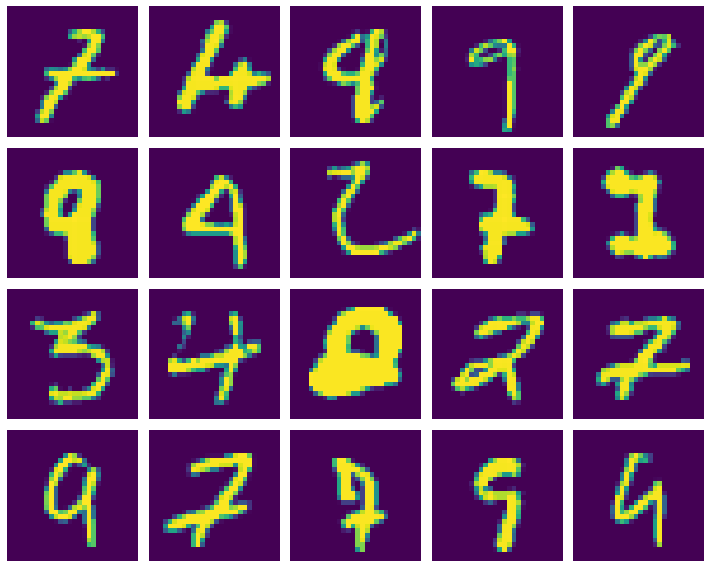
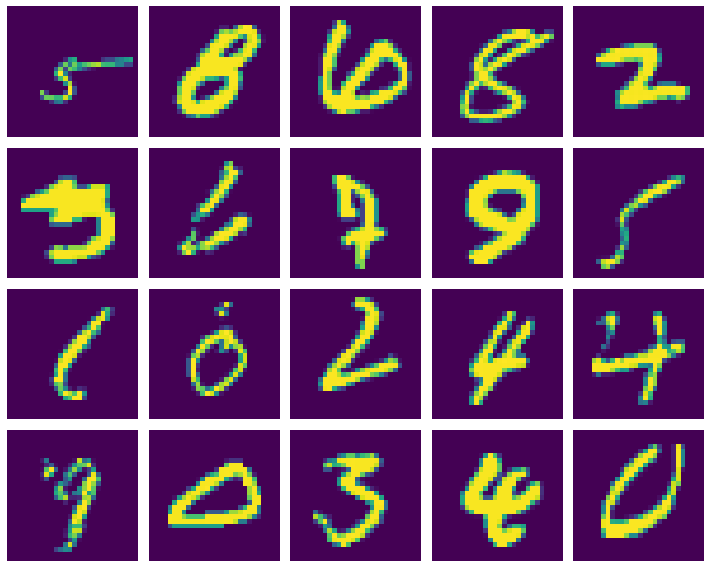
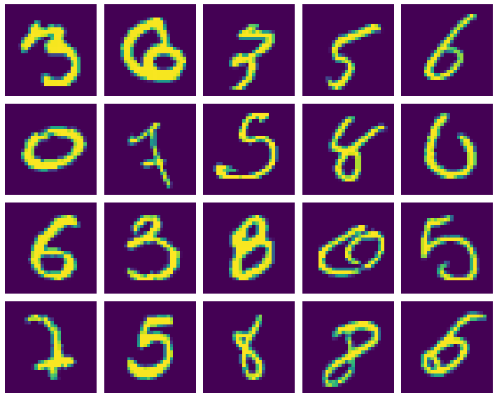

# Session 6 - Batch Normalization & Regularization

## Goal
Write three networks using GN, LN, BN, and L1/L2 regularization

## Submission Info

### Code Walkthrough
The `model.py` file contains a `Net` class that takes in a parameter called `norm`. This parameter can have the values "BN", "GN", or "LN",
which correspond to Batch, Group, and Layer normalization. The notebook imports this class and for each of these normalization methods, it constructs and trains a network (with appropriate L1/L2 regularization). The `fit` function takes in all the necessary parameters and trains the model, saving the model file to disk and returning training logs. These logs are then graphed. Finally, 20 incorrectly classified images are found for each network and displayed in a 5x4 matrix on the screen.

### Graphs
Training logs:

Misclassified images for BN network:

Misclassified images for GN network:

Misclassified images for LN network:

